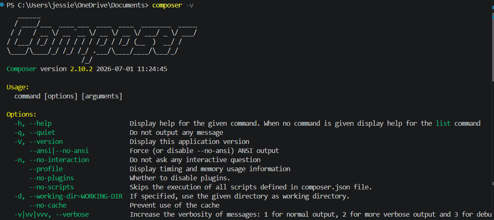
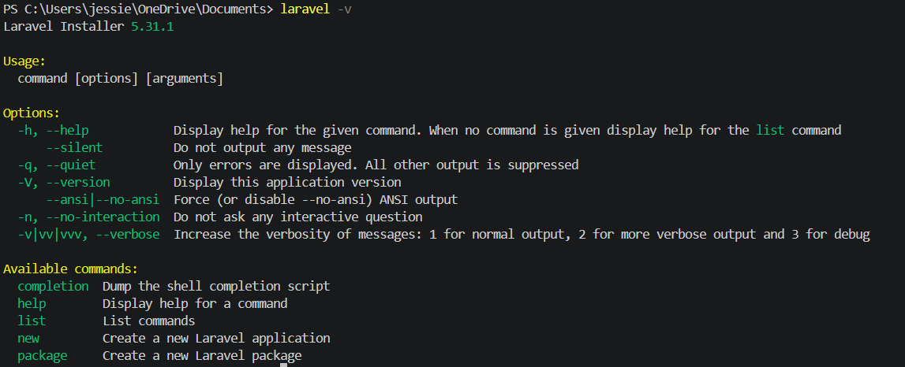
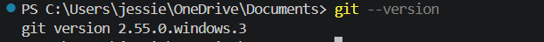
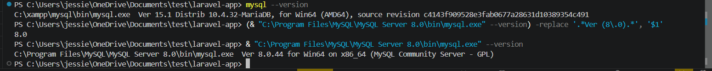
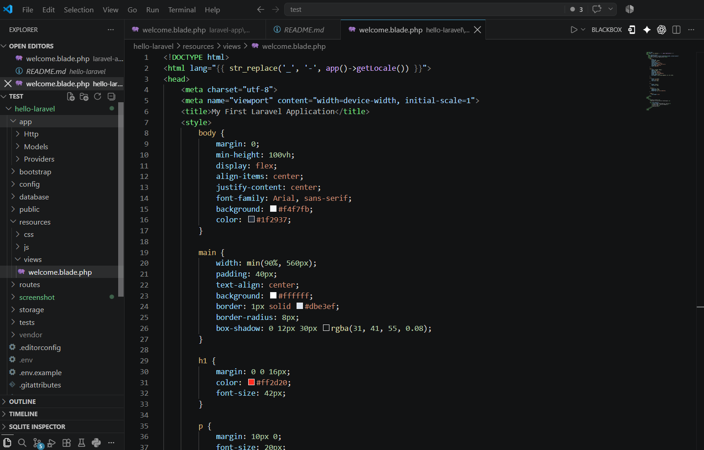
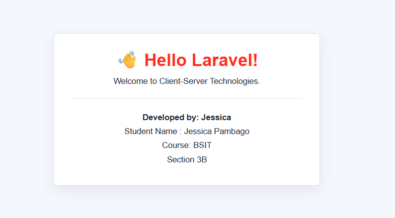

<h1 align="center">Hello Laravel: Client-Server Web Application</h1>

# Introduction

## Brief Overview of Laravel

Laravel is a PHP web application framework used to build modern, secure, and organized web systems. It provides a structure and starting point for creating applications, allowing developers to focus on building features instead of handling every technical detail manually (Laravel, n.d.). Laravel also includes useful tools such as routing, database migrations, authentication, Blade templating, and Artisan commands, which help make web development faster and more organized.

## Importance of Client-Server Technologies

Client-server technologies are important because they allow users and systems to communicate over a network. The client, such as a browser or mobile application, sends a request, while the server processes the request and sends back a response (MDN Web Docs, 2025). This setup is used in most modern web applications because it supports centralized data management, better security, scalability, and easier access from different devices.

## Purpose of the Project

The purpose of this project is to demonstrate the basic setup and use of a Laravel application as part of learning client-server technologies. It shows how a Laravel project is installed, opened in Visual Studio Code, run on a local development server, and documented with screenshots. This project also helps build familiarity with common development tools such as PHP, Composer, Git, MySQL, and GitHub.

## Objectives

- Installed and verified the required development tools, including PHP, Composer, Git, MySQL, and Visual Studio Code.
- Created and configured a Laravel project for local web application development.
- Opened the Laravel project in Visual Studio Code to view and manage the project files.
- Ran the Laravel application using the local development server.
- Customized and documented the Laravel project using a project README file.
- Uploaded project files and screenshots to GitHub using meaningful commit messages.

## Development Environment

- Operating System: Windows 10 Home Single Language 25H2, Build 26200
- PHP Version: PHP 8.2.12
- Laravel Version: Laravel Framework 12.65.0
- Composer Version: Composer 2.10.2
- Git Version: Git 2.55.0.windows.3
- MySQL Version: MariaDB 10.4.32
- VS Code Version: Visual Studio Code 1.132.0

## Installation Steps

## Step 1: Install PHP

1. Download the latest stable version of PHP from the official PHP website.
2. Install PHP on the local machine.
3. Open Command Prompt and verify the installation using:

**php -v or php --version**

4. Confirm that the installed PHP version is displayed.

**Screenshot:**

## Step 2: Install Composer

1. Download the Composer installer from the official Composer website.
2. Run the installer and ensure it is configured to use the installed PHP executable.
3. Verify the installation by running:

**composer -v or composer --version**

4. Confirm that the Composer version is displayed.

**Screenshot:**

## Step 3: Install Laravel

1. Open Command Prompt.
2. Check Composer:

**composer -v**

3. Install the Laravel Installer:

**composer global require laravel/installer**

4. Verify the Laravel Installer installation by running:

**laravel -V**

**Screenshot:**

## Step 4: Git Install

1. Go to the official Git website.
2. Open the installer and find the downloaded file:

**Git-2.x.x-64-bit.exe**

3. Install Git.

For a simple installation, you can leave the default settings and keep clicking:

**Next -> Next -> Next -> Install**

4. Verify the installation by running:

**git --version**

**Screenshot:**

## Step 5: MySQL Install

1. Go to the official MySQL website.
2. For an easy installation, you can use the Web Community installer.
3. Install the requirements.
4. Configure MySQL Server.
5. Verify the installation by running:

**mysql --version**

**Screenshot:**

## Step 6: Install VS Code

1. Go to the official VS Code website.
2. Open the installer, go to your Downloads folder, and double-click the downloaded file.
3. Accept the agreement and choose the installation location.
4. Install Visual Studio Code.
5. Open VS Code, then open the Laravel project.

**Screenshot:**

## Laravel Homepage

The Laravel application was opened in the browser to confirm that the local development server was running successfully.

**Screenshot:**

## Project Structure

- **app/** - Contains the main application code, including models, controllers, and other PHP classes used to build the system.
- **routes/** - Contains route files that define the URLs of the application and connect them to controllers or views.
- **resources/** - Contains the application's views, Blade templates, CSS, JavaScript, and other frontend resources.
- **public/** - Contains files that are directly accessible from the browser, such as `index.php`, images, CSS, and JavaScript files.
- **config/** - Contains configuration files for the application, including settings for the app, database, mail, services, and other Laravel features.
- **database/** - Contains database migrations, seeders, and factories used to create and manage database tables and test data.

## Problems Encountered

- PHP missing file
- PHP PATH issue
- Some commands are missing
- MySQL not reading the port

## Solution

The solution I used was to use AI for assistance. I also watched clips on TikTok and YouTube about how to properly install the required software.

## Reflection

In this project, I learned how to set up a Laravel application, but that is not all. I also learned the basic structure of a client-server web application. I learned that Laravel is not just a tool for writing PHP code, but a complete framework that organizes the development process. Through the installation and setup, I became more familiar with important tools such as PHP, Composer, Git, MySQL, and Visual Studio Code.

The challenges I encountered were some unexpected errors that made my mind go crazy, but at the same time, I learned so much about how to properly understand an error. For example, in my PHP setup, there were some missing files like `php.exe`, and there were also some missing commands. With the help of AI and some tutorials, I was able to identify the problems and find appropriate solutions.

Since Laravel is easy to use, it is popular among developers. Laravel is a PHP web application framework used to build modern websites and web applications. It provides ready-made tools and features for common tasks such as routing, database management, and authentication, which makes web development more organized, secure, and easier to maintain.

This knowledge will help me in future software development projects because I now understand the basic steps needed to prepare a development environment and run a web application locally. I also learned how to troubleshoot common setup problems, which is an important skill for any developer. In future projects, I can use Laravel to create more organized web applications and apply what I learned about client-server communication, database configuration, and project documentation. This experience also gave me more confidence to explore new tools, read errors carefully, and continue improving my skills as I build more projects. It also reminded me that patience is important when learning programming.

## References

Composer. (n.d.). *Introduction*. Composer documentation. https://getcomposer.org/doc/00-intro.md

Git. (n.d.). *Git documentation*. https://git-scm.com/doc

Laravel. (n.d.). *Installation*. Laravel documentation. https://laravel.com/docs/12.x

MDN Web Docs. (2025, June 23). *Client-server overview*. MDN. https://developer.mozilla.org/en-US/docs/Learn_web_development/Extensions/Server-side/First_steps/Client-Server_overview

PHP. (n.d.). *Installation and configuration*. PHP manual. https://www.php.net/manual/en/install.php
